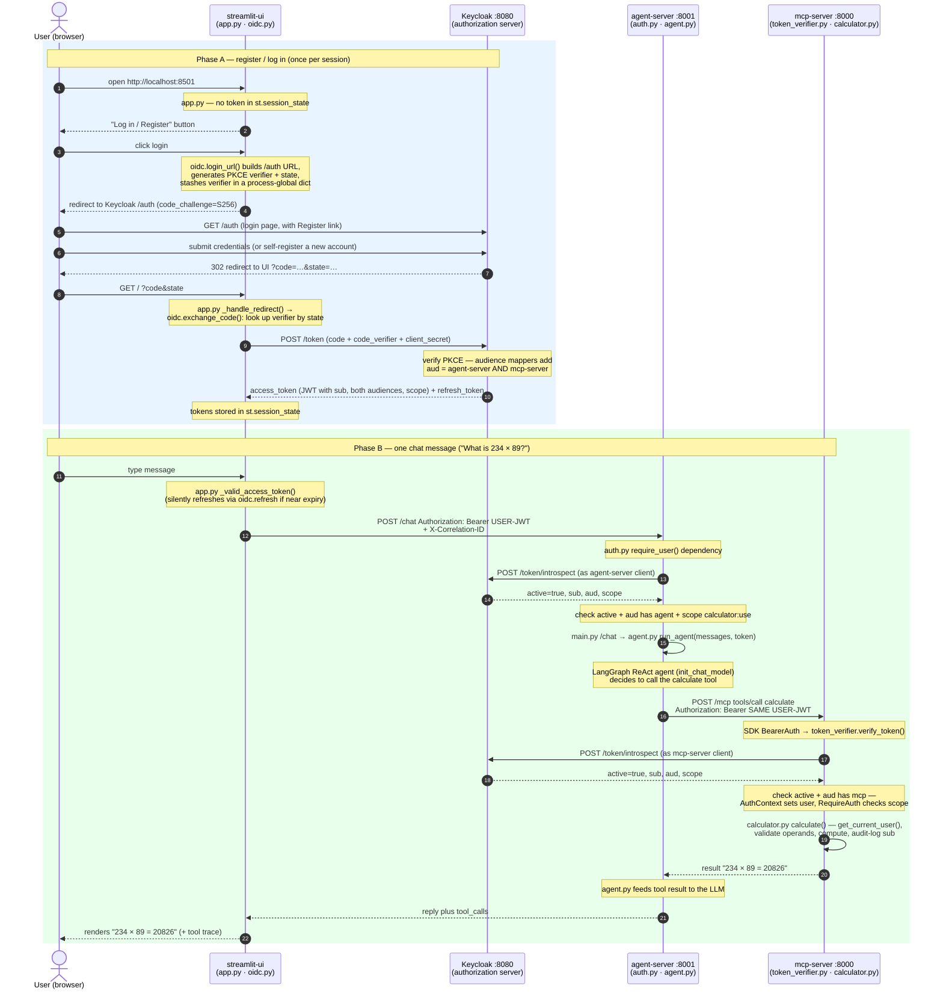

# OmniAssistant — Secure & Scalable Remote MCP Demo

A reference implementation of the official
[**MCP authorization tutorial**](https://modelcontextprotocol.io/docs/tutorials/security/authorization)
(OAuth 2.1 with a real Keycloak authorization server + RFC 7662 token
introspection), wrapped in the gateway/observability patterns from the GitHub blog article
[How to build secure and scalable remote MCP servers](https://github.blog/ai-and-ml/generative-ai/how-to-build-secure-and-scalable-remote-mcp-servers/):

```
        ① login / register (OIDC + PKCE)
 ┌────────────────────────────────────────────► ┌──────────────────────────────┐
 │                                               │  Keycloak (Docker)  :8080    │
 │        user JWT (aud = agent + mcp)           │  authorization server:       │
 │  ◄──────────────────────────────────────────  │  login page, registration,   │
 │                                               │  DCR, JWT issuance, JWKS     │
 │                                               └──────────────────────────────┘
 │                                                  ▲ introspect       ▲ introspect
 │                                                  │ (RFC 7662)        │
 ▼         ② chat + Bearer          ③ forward same Bearer               │
┌──────────────┐  REST /chat   ┌──────────────┐  OAuth 2.1 + MCP     ┌───────────────────────────┐
│ streamlit-ui │ ────────────► │ agent-server │ ───────────────────► │        mcp-server         │
│  (chatbot +  │               │  (LangGraph  │  streamable HTTP     │  calculator tools behind  │
│   login)     │ ◄──────────── │  + FastAPI)  │ ◄─────────────────── │  SDK auth / gateway /     │
│   :8501      │               │    :8001     │   Bearer token       │  observability   :8000    │
└──────────────┘               └──────────────┘                      └───────────────────────────┘
```

The **human logs in once** at the UI; that single JWT (stamped with both the
agent's and the MCP server's audience) authenticates every hop, and every
calculation is attributed to the signed-in user.

* **`keycloak/`** — the **authorization server**: Keycloak in Docker (as in the
  MCP tutorial) plus `setup_keycloak.py`, which automates the admin-console
  steps (client scopes with audience mappers for **both** services,
  self-registration, DCR trusted hosts, demo user, and confidential clients for
  the UI login + the introspection callers).
* **`mcp-server/`** — a remote MCP server (simple calculator tool) over the
  **streamable HTTP transport**. A pure OAuth 2.1 **resource server**: the MCP
  SDK's auth stack (`AuthSettings` + a `TokenVerifier`) guards `/mcp`, and every
  Bearer token is validated against Keycloak via **token introspection** — the
  tutorial's Python implementation — wrapped in the article's gateway,
  secrets-management and observability patterns.
* **`agent-server/`** — a very simple **LangGraph** ReAct agent exposed via
  **FastAPI**. It **verifies the user's token** on `/chat` (introspection) and
  then acts **on behalf of that user**, forwarding the same token to the MCP
  server (streamable HTTP + Bearer).
* **`streamlit-ui/`** — a **Streamlit** chatbot that **logs the human in**
  against Keycloak (OIDC authorization code + PKCE), holds the user's token,
  and shows which remote MCP tools were used.

Each service folder is fully self-contained: its own `uv` virtual environment,
its own `pyproject.toml`, and its own `.env` file.

> 📖 **Want to understand the internals?** Read
> [`docs/auth-explained.md`](docs/auth-explained.md) — the beginner-friendly,
> diagram-first tour of what auth achieves here — and
> [`docs/mcp-server-guide.md`](docs/mcp-server-guide.md) — a full end-to-end
> walkthrough of every module, the OAuth 2.1 flow, and an honest
> production-readiness assessment.

---

## The user journey, end to end

The diagram below traces one user from opening the app through a completed
calculation, naming the **module** in each service that does the work. There
are two phases: **A. Log in once** (OIDC authorization code + PKCE) and
**B. Every chat message** (verify → forward → introspect → run tool).



**What to notice:**

- **One login authorizes both hops.** The token minted in Phase A carries *two* audiences, so the agent can forward the *same* token to the MCP server and each accepts it (steps in green).
- **Every hop re-verifies independently.** Neither the agent nor the MCP server trusts the caller — both introspect the token with Keycloak (as their own confidential client) before doing any work.
- **Identity reaches the tool.** `calculator.py` reads the verified `sub`, so every operation is attributable to the real user.
- **Passwords live only in Keycloak.** The UI, agent, and MCP server never see credentials — only tokens.

---

## Prerequisites

* [Docker](https://www.docker.com/) (for Keycloak)
* [uv](https://docs.astral.sh/uv/) installed (`curl -LsSf https://astral.sh/uv/install.sh | sh`)
* Python ≥ 3.11 (uv will provision it)
* An **Anthropic API key** for the agent's LLM (any `init_chat_model` provider works via `AGENT_LLM_MODEL`)

## Setup & Run

Run each service from its own folder, in this order. Keycloak runs detached
(`-d`); the other three (`mcp-server`, `agent-server`, `streamlit`) each run
in the **foreground and hold the terminal**, so start each in its **own
terminal tab**.

### 1. Keycloak — the authorization server (port 8080)

```bash
cd keycloak
docker compose up -d          # tutorial's `docker run … start-dev` equivalent
python3 setup_keycloak.py     # waits for Keycloak, then configures it (stdlib only)
```

The first `docker compose up` pulls the Keycloak image and can take a minute;
`setup_keycloak.py` polls until Keycloak is ready, so it's safe to run right
after.

The script creates the `calculator:use` client scope
(with audience mappers binding tokens to **both** `http://localhost:8000/mcp`
and `http://localhost:8001`), enables self-registration, and creates three
confidential clients: `streamlit-ui` (browser login), `agent-server` and
`mcp-server` (token introspection). It deliberately seeds **no user
accounts** — you register your own from the UI (a production system never
ships standing credentials). Admin console: http://localhost:8080 (admin/admin).

### 2. MCP server (port 8000)

```bash
cd mcp-server
cp .env.example .env        # defaults match setup_keycloak.py out of the box
uv sync
uv run mcp-server
```

Verify: `curl http://localhost:8000/health`

### 3. Agent server (port 8001)

```bash
cd agent-server
cp .env.example .env        # then edit: set ANTHROPIC_API_KEY=sk-ant-...
uv sync
uv run agent-server
```

Verify: `curl http://localhost:8001/health` → shows agent **and** MCP server status.

### 4. Streamlit UI (port 8501)

```bash
cd streamlit-ui
cp .env.example .env
uv sync
uv run streamlit run app.py
```

Open http://localhost:8501. **Register an account** (the **Register** link on
Keycloak's login page — no accounts are pre-seeded), then chat, e.g.:

* “What is 234 × 89?” → the agent calls the remote `calculate` tool — attributed to your account in the MCP server's audit log.

### Try the security features directly

```bash
# No token → 401 with the RFC 9728 discovery pointer in WWW-Authenticate
curl -i -X POST http://localhost:8000/mcp

# Discovery documents
curl http://localhost:8000/.well-known/oauth-protected-resource/mcp
curl http://localhost:8080/realms/master/.well-known/oauth-authorization-server

# A forged token → 401 (Keycloak introspection says active: false)
curl -i -X POST http://localhost:8000/mcp -H "Authorization: Bearer forged"

# Prometheus metrics (latency, error rates, auth failures, tool calls)
curl http://localhost:8000/metrics
```

Or verify the whole identity flow at once (login → dual-audience token →
accepted by both hops). The test **provisions a throwaway user with a
generated password via the admin API and deletes it afterwards** — the
production-faithful alternative to a committed test account:

```bash
# with Keycloak + both servers running. Run it in the streamlit-ui uv env,
# which already has `requests`:
cd streamlit-ui && uv run python ../keycloak/test_identity.py
```

### Explore the tools with MCP Inspector

[MCP Inspector](https://github.com/modelcontextprotocol/inspector) is the
official interactive playground for MCP servers — list and call tools, view
the raw JSON-RPC, etc. It's a **separate tool** (not part of this repo, needs
Node.js for `npx`). Since `/mcp` is OAuth-protected, you first grab a user
token with the included CLI, then paste it into the Inspector.

> Prereqs: `mcp-server` running (port 8000), Keycloak running, and an account
> you registered in the UI.

**Step 1 — get a token** (valid 30 min in this demo). From the project root:

```bash
python3 keycloak/get_token.py -u <your-username>          # prompts for password
# …or print ONLY the token (to copy/pipe):
python3 keycloak/get_token.py -u <your-username> --token-only
```

Copy the printed `eyJ…` token.

**Step 2 — launch the Inspector** (downloads on first run):

```bash
npx @modelcontextprotocol/inspector
```

It starts a local proxy and prints a URL with a pre-filled proxy token, e.g.
`http://localhost:6274/?MCP_PROXY_AUTH_TOKEN=…` — **open that exact URL**. (That
`MCP_PROXY_AUTH_TOKEN` is the Inspector's *own* auth between your browser and its
local proxy — unrelated to your Keycloak token. Opening bare `:6274` just makes
it ask you to paste that proxy token.)

**Step 3 — configure the connection** (left panel):

| Field | Value |
|---|---|
| **Transport Type** | `Streamable HTTP` |
| **URL** | `http://localhost:8000/mcp` |
| **Authentication → Header Name** | `Authorization` (the default — leave it) |
| **Authentication → Bearer Token** | paste your `eyJ…` token from Step 1 (raw, **no** `Bearer ` prefix) |

Click **Connect** — the status should go green.

**Step 4 — explore.** Open the **Tools** tab → **List Tools** → you'll see
**`calculate`**. Select it, set `operation=multiply`, `a=6`, `b=7`, and **Run
Tool** → `6.0 multiply 7.0 = 42.0`. (Resources/Prompts tabs are empty — this
project defines only the one tool.)

**Troubleshooting**

| Symptom | Fix |
|---|---|
| `401` on connect | Token expired (re-run `get_token.py`, update the Bearer Token field, reconnect), or you pasted `Bearer ` in front — paste the raw token only |
| "Failed to connect" | Ensure Transport Type is `Streamable HTTP` (not SSE/STDIO) and the URL ends in `/mcp` |
| Inspector UI asks for a token / won't load | Open the pre-filled `?MCP_PROXY_AUTH_TOKEN=…` URL it printed, not bare `:6274` |

Tokens last 30 min in this demo (a dev-only relaxation set by
`setup_keycloak.py`; production keeps them short) — re-run `get_token.py` for a
fresh one when you get a 401.

> **Note:** the Inspector speaks the MCP protocol, so it only works against the
> **mcp-server** (`:8000/mcp`). The **agent-server** is a plain REST API — test
> its `/chat` endpoint with `curl` (same Bearer token works, thanks to the
> dual-audience token), not the Inspector.

---

## Which module implements which part of the tutorial / article

| Feature | Where it is implemented |
|---|---|
| **OAuth 2.1 as the authorization standard** | Keycloak (`keycloak/docker-compose.yml`), configured by `keycloak/setup_keycloak.py` |
| **Protected Resource Metadata (RFC 9728)** — `/.well-known/oauth-protected-resource/mcp` | Served automatically by the MCP SDK (`AuthSettings(resource_server_url=…)` in `mcp-server/src/mcp_server/server.py`) |
| **Authorization Server Metadata discovery (RFC 8414 / OIDC)** | Keycloak serves it at `/.well-known/openid-configuration`; the UI reads it to build the login URL |
| **Dynamic Client Registration (RFC 7591)** | Keycloak (trusted-hosts policy set by `setup_keycloak.py`) — available for agentic clients; the fixed services here use pre-registered clients |
| **Resource Indicators (RFC 8707) / audience binding** | Keycloak audience mapper (`aud` = canonical MCP URI, set by `setup_keycloak.py`) · enforced in `mcp-server/src/mcp_server/auth/token_verifier.py` (`_validate_resource`) |
| **Authorization code + PKCE login (human)** | `streamlit-ui/oidc.py` (+ `app.py`) — the user signs in/registers; the token is reused across hops |
| **On-behalf-of / user-token propagation** | `agent-server/src/agent_server/auth.py` verifies the user token; `agent.py` forwards it to the MCP server (dual-audience token; RFC 8693 token exchange is the hardening step) |
| **Token validation — RFC 7662 introspection** (the tutorial's Python `IntrospectionTokenVerifier`) | `mcp-server/src/mcp_server/auth/token_verifier.py`, plugged into `FastMCP(token_verifier=…)` |
| **Error handling standards** — 401 invalid/missing token, 403 insufficient permissions, proper `WWW-Authenticate` headers | The SDK's `RequireAuthMiddleware` (enabled via `AuthSettings` in `server.py`) |
| **User identity from token claims (`sub`)** | SDK auth context → `mcp-server/src/mcp_server/auth/context.py` (`AuthenticatedUser`) |
| **Identity on every operation** | `mcp-server/src/mcp_server/tools/calculator.py` (the validated `sub` is attached to each tool invocation's audit log) |
| **Principle of least privilege (scopes)** | `calculator:use` required by `AuthSettings(required_scopes=…)` before any tool runs |
| **AI-gateway: rate limiting** | `mcp-server/src/mcp_server/gateway/rate_limiter.py` (token bucket, 429 + `Retry-After`) |
| **AI-gateway: auth before requests reach the server** | Rate limiter/gateway middlewares run before the mounted MCP app; the SDK's bearer-auth middleware guards the MCP routes (`main.py`) |
| **AI-gateway: security header injection** | `mcp-server/src/mcp_server/gateway/security_headers.py` |
| **AI-gateway: circuit breakers / fail fast** | `mcp-server/src/mcp_server/gateway/circuit_breaker.py` (closed/open/half-open, 503 fast-fail) |
| **AI-gateway: CORS handling** | `CORSMiddleware` configuration in `mcp-server/src/mcp_server/main.py` |
| **Secrets: provider abstraction (Vault / AWS / Azure)** | `mcp-server/src/mcp_server/secrets_manager.py` (`SecretProvider` interface + provider stubs) |
| **Secrets: startup validation / fail fast** | `secrets_manager.validate_startup(["MCP_OAUTH_CLIENT_SECRET"])` (mcp-server `main.py`) · `settings.validate_startup()` (agent-server) |
| **Secrets: no signing keys in the resource server** | Token signing keys live entirely inside Keycloak; the MCP server holds only its introspection client secret |
| **Structured logging, consistent across request boundaries** | `mcp-server/src/mcp_server/observability/logging.py` · `agent-server/src/agent_server/observability.py` (JSON logs) |
| **Correlation IDs across the entire system** | `observability/correlation.py` (mcp-server) — UI → agent → MCP server propagate `X-Correlation-ID` |
| **Distributed tracing (OpenTelemetry)** | `mcp-server/src/mcp_server/observability/tracing.py` (FastAPI auto-instrumentation; console/OTLP exporters) |
| **Security event logging** | `mcp-server/src/mcp_server/observability/security_events.py` (resource-server events) + Keycloak's own event log (logins, registrations, issuance) |
| **Metrics: latency, error rates, auth failures, resource utilization** | `mcp-server/src/mcp_server/observability/metrics.py` → `GET /metrics` (Prometheus format) |
| **Dedicated health endpoint for load balancers** | `GET /health` on both mcp-server and agent-server (agent health also probes the MCP server) |
| **Scalability: stateless remote transport** | `server.py` — `FastMCP(..., stateless_http=True, json_response=True)` over streamable HTTP; any replica can serve any request |
| **Input validation on tools** | `tools/calculator.py` (`_validate_operand`, divide-by-zero, unknown-operation rejection) |

### Endpoint map

| Endpoint | Purpose |
|---|---|
| `POST http://localhost:8000/mcp` | MCP streamable-HTTP endpoint (Bearer token required) |
| `GET  http://localhost:8000/.well-known/oauth-protected-resource/mcp` | RFC 9728 discovery (served by the MCP SDK) |
| `GET  http://localhost:8000/health` | Load-balancer health check |
| `GET  http://localhost:8000/metrics` | Prometheus metrics |
| `GET  http://localhost:8080/realms/master/.well-known/oauth-authorization-server` | RFC 8414 AS metadata (Keycloak) |
| `GET  http://localhost:8080/realms/master/.well-known/openid-configuration` | OIDC discovery (Keycloak) |
| `POST http://localhost:8080/realms/master/clients-registrations/openid-connect` | RFC 7591 dynamic client registration (Keycloak) |
| `GET  http://localhost:8080/realms/master/protocol/openid-connect/auth` | Authorization endpoint — real login page (Keycloak) |
| `POST http://localhost:8080/realms/master/protocol/openid-connect/token` | Code exchange & refresh (Keycloak) |
| `POST http://localhost:8080/realms/master/protocol/openid-connect/token/introspect` | RFC 7662 token introspection (Keycloak, confidential clients only) |

### Production notes

This demo follows the tutorial's development setup; before production,
follow its warnings: run Keycloak per the [production guide](https://www.keycloak.org/server/configuration-production)
(dedicated realm, TLS, persistent DB, real credentials — not `start-dev` +
admin/admin), derive audiences from the client's RFC 8707 `resource`
parameter instead of a fixed mapper value, restrict dynamic client
registration (vetted/audited, initial access tokens), run the gateway
concerns (rate limiting, headers, caching, circuit breaking) once at a real
AI-gateway tier, replace in-memory tool state with user-scoped persistent
storage, and load the introspection client secret from a dedicated secrets
service via the `SecretProvider` interface.
