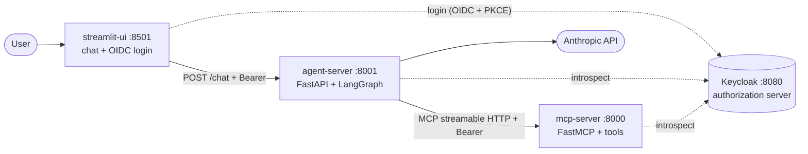
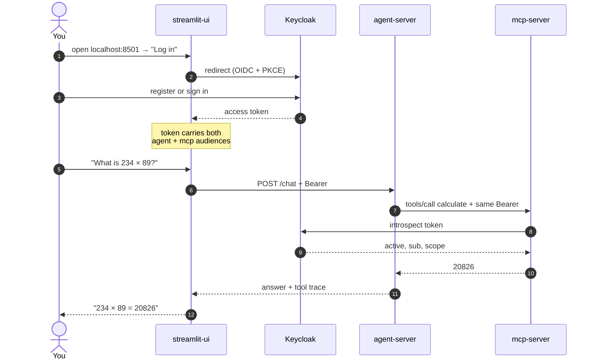

# OmniAssistant

A remote MCP server secured with OAuth 2.1 and Keycloak, with a LangGraph agent
and a chat UI. One human login authorizes every hop, and every tool call is
attributed to the signed-in user.

## Architecture



## User journey



## Prerequisites

- [Docker](https://www.docker.com/) — for Keycloak
- [uv](https://docs.astral.sh/uv/) — `curl -LsSf https://astral.sh/uv/install.sh | sh`
- An Anthropic API key for the agent

## Run

Four services, each from its own folder. Keycloak runs detached; the other three
hold the terminal, so give each its own tab.

**1. Keycloak** (:8080)

```bash
cd keycloak && docker compose up -d && python3 setup_keycloak.py
```

**2. MCP server** (:8000)

```bash
cd mcp-server && cp .env.example .env && uv sync && uv run mcp-server
```

**3. Agent server** (:8001) — set `ANTHROPIC_API_KEY` in `.env` first

```bash
cd agent-server && cp .env.example .env && uv sync && uv run agent-server
```

**4. UI** (:8501)

```bash
cd streamlit-ui && cp .env.example .env && uv sync && uv run streamlit run app.py
```

Open http://localhost:8501 and **register an account** — no users are
pre-seeded. Then ask it something like "What is 234 × 89?".

Health checks: `curl http://localhost:8000/health` ·
`curl http://localhost:8001/health`

## MCP Inspector

[MCP Inspector](https://github.com/modelcontextprotocol/inspector) lists and
calls tools directly against the MCP server. Since `/mcp` is OAuth-protected,
grab a token first. Requires Node.js and an account you registered in the UI.

**1. Get a token** (valid 30 min):

```bash
python3 keycloak/get_token.py -u <your-username> --token-only
```

**2. Launch the Inspector:**

```bash
npx @modelcontextprotocol/inspector
```

Open the exact URL it prints — it includes a pre-filled `MCP_PROXY_AUTH_TOKEN`
(the Inspector's own auth, unrelated to Keycloak).

**3. Connect** using the left panel:

| Field | Value |
|---|---|
| Transport Type | `Streamable HTTP` |
| URL | `http://localhost:8000/mcp` |
| Authentication → Bearer Token | your `eyJ…` token, raw (no `Bearer ` prefix) |

**4. Explore** — Tools tab → List Tools → pick `calculate`, set
`operation=multiply`, `a=6`, `b=7` → Run Tool → `6.0 multiply 7.0 = 42.0`.

| Problem | Fix |
|---|---|
| `401` on connect | Token expired — get a fresh one; or you pasted `Bearer ` in front |
| Failed to connect | Transport must be `Streamable HTTP` and the URL must end in `/mcp` |
| Inspector asks for a token | Open the printed `?MCP_PROXY_AUTH_TOKEN=…` URL, not bare `:6274` |

The Inspector speaks MCP, so it only works against `mcp-server`. The
agent-server is plain REST — test `/chat` with curl.
